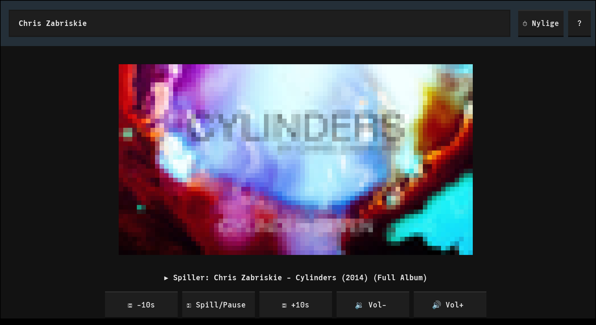

# RYTMUZ

A simple, audio-only YouTube music player built with Python, Textualize, yt-dlp, and mpv.



## Features

- **Audio-only**: Audio playback only, no video distractions
- **Easy search**: Always-available search field with Ctrl+S hotkey
- **Recent songs**: Quick access to recently played songs with Ctrl+R
- **Simple controls**: Play/pause, seek ±10s, volume adjustment
- **Smart caching**: Fast replay of recent songs
- **Visual feedback**: Thumbnails displayed with terminal graphics
- **Focused listening**: Minimal interface for distraction-free music listening

## Requirements

- Python 3.10+
- `yt-dlp` command-line tool - **recent version required** (does all the heavy lifting for YouTube integration)
- `mpv` media player
- `libjpeg` library (for image decoding with Pillow - thumbnail display)

## Setup

1. Install system dependencies:
   ```bash
   # Ubuntu/Debian
   # Note: apt yt-dlp is often outdated, install via pipx instead
   sudo apt install mpv libjpeg62-turbo
   pipx install yt-dlp

   # macOS
   brew install yt-dlp mpv jpeg
   ```

2. Run the app:
   ```bash
   # Using uvx (recommended - no installation needed)
   uvx rytmuz

   # Or using pipx
   pipx run rytmuz

   # Or install with pipx for persistent use
   pipx install rytmuz
   rytmuz
   ```

## Optional: Improve Search Results with YouTube API

By default, rytmuz uses yt-dlp for searching, which provides basic keyword-based results. For better music-specific filtering (using YouTube's music topic and category filters), you can set up a free YouTube Data API v3 key:

### Benefits
- **Music-focused results**: Filters to music content using YouTube's music category
- **Better relevance**: Uses YouTube's content categorization, not just keywords
- **Safe search**: Moderate safe search filtering enabled
- **Free tier**: Up to 100 searches per day at no cost

### Setup Steps

1. **Enable YouTube Data API v3**
   - Go to [Google Cloud Console API Library](https://console.cloud.google.com/apis/library/youtube.googleapis.com)
   - Click "Enable" (you may need to create a project first)

2. **Create an API Key**
   - Go to [API Credentials](https://console.cloud.google.com/apis/credentials)
   - Click "Create Credentials" → "API key"
   - Copy the generated API key

3. **Restrict the API Key** (recommended for security)
   - Click on your new API key to edit it
   - Under "API restrictions", select "Restrict key"
   - Choose "YouTube Data API v3" from the list
   - Save

4. **Set the environment variable**
   ```bash
   export YOUTUBE_API_KEY="your-api-key-here"

   # Or add to your shell profile (~/.bashrc, ~/.zshrc, etc.)
   echo 'export YOUTUBE_API_KEY="your-api-key-here"' >> ~/.bashrc
   ```

5. **Run rytmuz** - It will automatically use the API key if available

## Usage

- **Help**: Press F1 or click the ? button to see all keyboard shortcuts and controls
- **Search**: Type in the search box and press Enter, or press Ctrl+S to focus search
- **Play song**: Click on a search result or press Enter when focused
- **Recent songs**: Click the ⏱ Recent button or press Ctrl+R
- **Quit**: Press Ctrl+C

## Design Decisions

- **No queueing**: Immediate playback on selection (may add later)
- **No auto-next**: Stops after song ends (may add later)
- **Minimal playback UI**: No progress bar or timeline to keep focus on the music, not the interface
- **Audio-only**: No visualization to encourage focused listening
- **Fast replay**: Cached data enables instant playback for favorite songs
